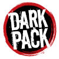

# Vampire Editor

This is a character generator for Vampires: Dark Ages.
The editor will be in English and German, but as of now some parts may only have English texts available. After the German version of the 20th anniversary edition is published, I certainly will add all German translations.

## Known Issues

There is a difference between the cost for clan apostate in the German and English version of the anniversary edition.

## Development

### Setup
This tool uses my [MyXML library](https://github.com/Antafes/MyXML) for parsing and writing XML files.
Therefore access to the GitHub Maven registry is needed.
Please follow the steps described in [GitHub Docs](https://docs.github.com/en/packages/working-with-a-github-packages-registry/working-with-the-apache-maven-registry) for how to set up everything needed to access GitHubs Maven registry.
The descriptions are made with linux in mind, for Windows users just replace the `~` with the following path: `C:\Users\[your username]\`

If your IDE supports modules and has something available, modules for the following would be helpful:
- Maven (obviously ^^)
- Lombok (if available Delombok or something of that kind)
- TestNG

To make adjustments on the build pipelines in Concourse CI, you would also need it's CLI tool "fly".
This can simply be downloaded from my [CI Server](https://ci.wafriv.de/).
Login to the CI Server is only available for contributors!
The full documentation on Concourse can be found on their [website](https://concourse-ci.org/docs.html).

### Working on the project

Development needs to be done on its own branch derived from the dev branch.
To get your changes merged into dev, a pull request should be created.
After someone reviewed the changes and the CI also told everything is fine, it can be merged.
The merge commit should contain one of the keywords described [here](https://docs.github.com/en/issues/tracking-your-work-with-issues/linking-a-pull-request-to-an-issue).
This ensures that the issue is closed after everything is merged into the master branch.
At that point the work is done and the work branch can be deleted, either during the merge of the PR or manually and the issue is put on "Status check passed".

After everything is finished for one version, a PR is created against the master branch.
To ensure nothing stupid can be added, this PR needs to be approved by a code owner.
At that point the version should also be raised (see [Deployment](#deployment)).

## Deployment

If a new version should be released, adjust the version in the VERSION file first and commit it accordingly into the master branch.
The build pipeline will automatically check if the version has been changed and thus will create a new release.

## Copyright and Trademark

Portions of the materials are the copyrights and trademarks of Paradox Interactive AB, and are used with permission. 
All rights reserved. 
For more information please visit https://worldofdarkness.com.
